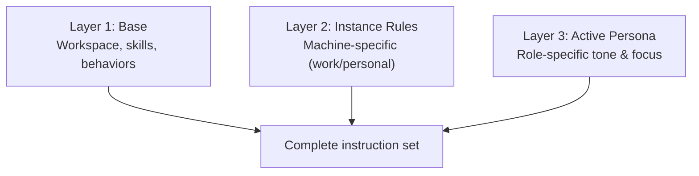

# Copilot CLI Starter

A ready-to-use Copilot CLI (and VS Code) workspace template with personas, skills, agents, and an interactive setup wizard.

## Prerequisites

Before getting started, make sure you have:

- **Git** — [Install Git](https://git-scm.com/downloads)
- **GitHub Copilot CLI** — [Install Copilot CLI](https://docs.github.com/en/copilot/concepts/agents/about-copilot-cli) (requires an active Copilot subscription)
- **GitHub CLI (`gh`)** — [Install gh CLI](https://cli.github.com/) (used for authentication and repo management)
- **PowerShell 6+** — [Install PowerShell](https://learn.microsoft.com/en-us/powershell/scripting/install/installing-powershell) (Windows ships with PowerShell 5.1; version 6+ must be installed separately)
- **Python 3.10+** — [Install Python](https://www.python.org/downloads/) (required for comparison and sync scripts)
- **Node.js 18+** — [Install Node.js](https://nodejs.org/) (required for MCP servers like Playwright; provides `npx`)

Optional:
- **VS Code** with GitHub Copilot extension — if you prefer IDE-based Copilot over CLI
- **WSL** or **Docker** — for isolated development environments

## Quick Start

1. **Fork** this repo to your own GitHub account
2. **Clone** your fork locally:
   ```powershell
   git clone https://github.com/YOUR_USERNAME/copilot-cli-starter.git ~/copilot-cli-starter
   ```
3. **Run the setup wizard:**
   ```powershell
   cd ~/copilot-cli-starter
   .\init.ps1
   ```
4. **Launch Copilot CLI** in a new terminal:
   ```powershell
   copilot
   ```
5. **Verify** — run `/instructions` to see all 3 layers loaded

## Quick Links

- [CHANGELOG](./CHANGELOG.md)

## What's Included

### 7 Personas
Role-specific AI assistants you can switch between:

| Persona | Description |
|---------|-------------|
| `productivity` | Daily productivity — calendar, email, tasks, time management |
| `deep-technical` | Expert Microsoft solutions engineer — implementation & troubleshooting |
| `security-architect` | Security technical architect — positioning & enablement |
| `marketing` | Marketing strategist — messaging, campaigns, competitive positioning |
| `program-manager` | Program management — planning, tracking, stakeholder management |
| `architect-marketer` | Blends technical depth with GTM & program management |
| `hypervelocity-engineer` | HVE practitioner — AI-native, outcome-focused rapid delivery |

Switch personas in any of these ways:
- **In conversation:** Just say "switch to productivity" or "change persona to deep-technical"
- **Via the switch-persona skill:** Copilot auto-detects when you want to switch
- **Via script:** `~/.copilot/Switch-CopilotPersona.ps1 -Persona productivity`
- **List all:** `~/.copilot/Switch-CopilotPersona.ps1 -List`

<!-- CUSTOMIZE: These personas are examples. Edit any AGENTS.md to match your role, or create new ones by adding a directory under personas/ with an AGENTS.md file. -->

### 16+ Skills
Portable capabilities that auto-load when relevant (works in both CLI and VS Code):
- Meeting prep, email triage, content drafting, research, project status
- KQL queries, PDF/DOCX/PPTX/XLSX manipulation
- Environment advisor, skill creator, and more

### Custom Agents
Specialized agents for complex workflows:
- Meeting notes summarizer, transcript processor, video analyzer, slide architect
- See `agents/` for the full list — add your own by creating `.agent.md` files

### 3-Layer Instruction Model



## Customization Guide

### Create a New Persona

1. Create a directory under `~/.copilot/personas/` with your persona name:
   ```powershell
   mkdir ~/.copilot/personas/my-role
   ```
2. Create an `AGENTS.md` file with your role definition:
   ```markdown
   # Persona: My Custom Role

   You are a [description of expertise and approach].

   ## Tone & Style
   - [how you want Copilot to communicate]

   ## Core Focus Areas
   - [domain expertise areas]

   ## Behaviors
   - [specific behavioral rules]
   ```
3. The switch script will auto-detect it on next run:
   ```powershell
   ~/.copilot/Switch-CopilotPersona.ps1 -List
   ```
   Or just tell Copilot: "switch to my-role"

### Edit Instance Rules (Layer 2)

Edit `~/.copilot/personas/active/.github/instructions/instance.instructions.md` to change machine-specific rules.

### Add a New Skill

See the [Agent Skills standard](https://agentskills.io) or copy an existing skill directory as a template.

## CLI vs VS Code

Both are supported! The init script auto-detects which you have and deploys accordingly. Skills, personas, and agents use the same format in both environments.

## Known Limitations

- **WSL is untested** — this setup is built and tested on Windows with PowerShell. WSL may work but has not been validated yet.
- **Native Linux is untested** — see the sync repo for tracking on Linux support
- **VS Code MCP config** is deployed separately and not auto-synced with CLI MCP
- Known issues from the upstream config repo may not always be reflected here — check with the repo maintainer for the latest

## Pulling Updates

When the template maintainer publishes improvements, you can pull them into your fork.

### First Time Setup

The first update must be done manually (the update skill doesn't exist on your machine yet):

```powershell
cd ~/copilot-cli-starter
git remote add upstream https://github.com/jimbanach/copilot-cli-starter.git
git fetch upstream
git merge upstream/main
.\init.ps1    # re-deploy to install new skills
```

### After First Update — Use Copilot

Once the `template-update` skill is installed, just ask Copilot:

> **"Check for starter updates"** or **"Pull starter updates"**

The skill auto-finds your repo, checks upstream, and lets you review and selectively incorporate changes.

### Manual Alternative

```powershell
cd ~/copilot-cli-starter
git fetch upstream
git log HEAD..upstream/main --oneline    # See what's new
git merge upstream/main --no-commit      # Preview merge
git diff --staged                        # Review changes
git commit -m "Pull upstream updates"    # Accept, or git merge --abort to cancel
```

After pulling updates, re-run `.\init.ps1` to deploy new content to `~/.copilot/`.

## Contributing

Improvements are welcome! See [CONTRIBUTING.md](./CONTRIBUTING.md) for how to:
- Fork, make changes, and submit a PR
- What makes a good contribution
- The review process
