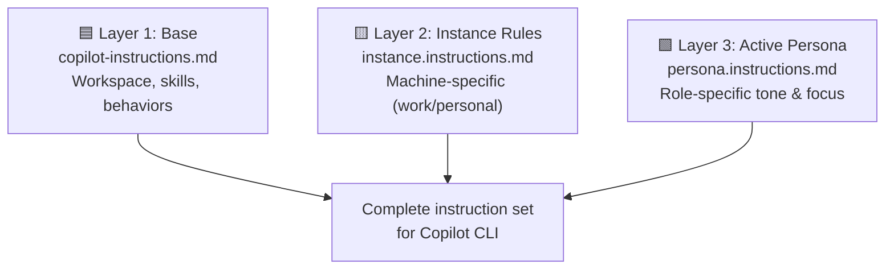
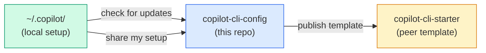

# Copilot CLI Config

Portable Copilot CLI configuration with 3-layer instruction model, persona switching, and smart sync.

> **🚧 v2.0 Upgrade In Progress** — A major update is coming from upstream that adds execution discipline, skill chaining, project analysis, task orchestration, and implementation playbooks. Current stable release: [v1.5.1](https://github.com/jimbanach/copilot-cli-starter/releases/tag/v1.5.1).

**NOTE**  If you are not {{YOUR_NAME}}, please do not commit or add anything to this repo.  Please use the CLI-Starter and build your own setup from there.  All improvements here will be added to the starter repo.  I do not have a way to limit PR's and Commits on this repo or it's branches as i'm not paying for GH Teams.

## Quick Links

- [CHANGELOG](./CHANGELOG.md)
- [Init Script Details](./docs/init-script-details.md)
- [Effective Project Prompts](./docs/effective-project-prompts.md)

## Table of Contents

- [Prerequisites](#prerequisites)
- [Account Setup](#account-setup)
- [Architecture: 3-Layer Instruction Model](#architecture-3-layer-instruction-model)
- [Persona Switching](#persona-switching)
- [Repo Structure](#repo-structure)
- [Init Script](#init-script)
- [Config-Sync Workflows](#config-sync-workflows)
- [Reviewing Peer PRs](#reviewing-peer-prs)
- [Save State Protocol](#save-state-protocol)
- [How To](#how-to)
- [Prompt Guidance](#prompt-guidance)
- [Starter Prompts](#starter-prompts)

## Prerequisites

- **Git** — [Install](https://git-scm.com/downloads)
- **GitHub CLI (`gh`)** — [Install](https://cli.github.com/)
- **GitHub Copilot CLI** — [Install](https://docs.github.com/en/copilot/concepts/agents/about-copilot-cli)
- **PowerShell 6+** — [Install](https://learn.microsoft.com/powershell/scripting/install/installing-powershell)
- **Python 3.10+** — [Install](https://www.python.org/downloads/)
- **Node.js 18+** *(optional)* — [Install](https://nodejs.org/) (needed for MCP servers)

The `init.ps1` script checks for these automatically and exits with install links if any are missing.

## Account Setup

This repo is hosted under `{{YOUR_NAME}}banach` (regular GitHub account, not enterprise-managed). Both work and personal machines access it through this account.

| Machine | gh CLI account | Role |
|---------|---------------|------|
| **Work machine** | `{{YOUR_NAME}}banach` | Push to `work` branch, merge to `main` |
| **Personal laptop** | `jrbanach` (collaborator) | Push to `personal` branch, merge to `main` |

### Switching Accounts

```powershell
# Check which account is active
gh auth status

# Switch between accounts
gh auth switch

# Add a new account
gh auth login --web
```

The `init.ps1` script verifies your active account before proceeding. If the wrong account is active, it tells you how to switch.

## Architecture: 3-Layer Instruction Model

Copilot CLI natively loads instructions from multiple locations. This setup uses three layers that load simultaneously on every session:



### Layer Reference

| Layer | Purpose | File Path | When to Edit |
|-------|---------|-----------|-------------|
| **1. Base** | Workspace structure, skills catalog, persona list, general behaviors | `~/.copilot/copilot-instructions.md` | When adding new skills, changing workspace structure, or updating universal behaviors |
| **2. Instance** | Machine-specific rules (work: confidentiality, paths; personal: personal rules) | `~/.copilot/personas/active/.github/instructions/instance.instructions.md` | Rarely — only when instance rules change |
| **3. Persona** | Role-specific tone, behaviors, domain expertise (`applyTo: "**"` frontmatter) | `~/.copilot/personas/active/.github/instructions/persona.instructions.md` | Never edit directly — use `Switch-CopilotPersona.ps1` |

### How Layers Are Loaded

- **Layer 1:** Copilot CLI always loads `~/.copilot/copilot-instructions.md` as the user-level instruction file
- **Layers 2 & 3:** The environment variable `COPILOT_CUSTOM_INSTRUCTIONS_DIRS` points to `~/.copilot/personas/active/`. Copilot CLI finds:
  - `.github/instructions/persona.instructions.md` → Layer 3 (persona, with `applyTo: "**"` frontmatter)
  - `.github/instructions/instance.instructions.md` → Layer 2 (instance rules)

### How to Edit Each Layer

**Layer 1 — Base instructions:**
```powershell
# Edit directly
code ~/.copilot/copilot-instructions.md
# Changes take effect on next Copilot CLI session
```

**Layer 2 — Instance rules:**
```powershell
# Edit directly (rarely needed)
code ~/.copilot/personas/active/.github/instructions/instance.instructions.md
# Changes take effect on next Copilot CLI session
```

**Layer 3 — Persona (use the switch script, don't edit directly):**
```powershell
# Switch persona
~/.copilot/Switch-CopilotPersona.ps1 -Persona productivity

# List available personas
~/.copilot/Switch-CopilotPersona.ps1 -List

# To edit a persona's content, edit the library copy:
code ~/.copilot/personas/productivity/persona.instructions.md
# Then switch to it again to deploy
```

## Persona Switching

The `Switch-CopilotPersona.ps1` script manages Layer 3. It:
- Copies the selected persona's `persona.instructions.md` into `personas/active/.github/instructions/persona.instructions.md`
- **Never touches Layers 1 or 2**
- Auto-detects new personas: if you add a new persona directory, the script automatically adds it to the Layer 1 persona list
- Supports `-Target` parameter: `cli`, `vscode`, `all`, or `auto` (default)

### Available Personas

| Persona | Description |
|---------|-------------|
| `productivity` | Daily productivity assistant — calendar, email, tasks, time management |
| `deep-technical` | Expert Microsoft solutions engineer — hands-on implementation and troubleshooting |
| `security-architect` | Security partner marketing technical architect — positioning and enablement |
| `marketing` | Marketing strategist — messaging, campaigns, content, competitive positioning |
| `program-manager` | Program management partner — planning, tracking, stakeholder management |
| `architect-marketer` | Technical Marketing Professional — blends technical depth with GTM and program management |
| `hypervelocity-engineer` | HVE practitioner — AI-native, outcome-focused rapid delivery methodology |

## Repo Structure

```
copilot-cli-config/
├── README.md
├── CHANGELOG.md
├── PLAN.md                                # Implementation plan
├── instance-config.template.json          # Per-instance config schema
│
├── base/
│   ├── copilot-instructions.md.template   # Layer 1 template with {{variables}}
│   └── instance-rules/
│       ├── work.instructions.md           # Layer 2: work machine rules
│       └── personal.instructions.md       # Layer 2: personal machine rules
│
├── personas/                              # Layer 3: one persona.instructions.md per persona
│   ├── productivity/persona.instructions.md
│   ├── deep-technical/persona.instructions.md
│   └── ...                                # See Available Personas table above
│
├── skills/                                # Portable skills (CLI + VS Code)
│   ├── humanizer/                         # Each skill: SKILL.md + scripts/ + references/
│   ├── kql-queries/
│   └── ...                                # 16+ skills total
│
├── agents/                                # Custom agent profiles (.agent.md)
│   ├── meeting-notes-summarizer.agent.md
│   └── ...                                # + scripts/
│
├── scripts/                               # Utility scripts
│   ├── New-CopilotProject.ps1
│   └── Switch-CopilotPersona.ps1
│
└── mcp/                                   # MCP server configs
    ├── mcp-config.universal.json          # CLI: Playwright + MS Docs
    ├── mcp-config.work.json               # CLI: + WorkIQ
    └── mcp.vscode.universal.json          # VS Code format
```

### Branch Strategy

| Branch | Purpose | Who pushes |
|--------|---------|------------|
| `main` | Universal baseline — shared across all instances | Either machine, after review |
| `work` | Work-specific additions and overrides | Work machine only |
| `personal` | Personal-specific additions and overrides | Personal laptop only |

### What's NOT in the Repo

| Item | Reason |
|------|--------|
| `config.json` | GitHub login, model preferences — instance-specific |
| `permissions-config.json` | Local filesystem paths |
| `instance-config.json` | Per-machine settings (generated by `init.ps1`) |
| `session-state/`, `session-store.db` | Runtime/chat history |
| `logs/`, `ide/`, `pkg/` | Runtime data |
| `_disabled/` | Locally disabled agents/skills — place items here to deactivate without deleting |
| `CopilotWorkspace/` projects | Company-confidential project data |
| `GitHubProjects/` projects | GitHub-backed projects (separate repos) |
| `__pycache__/`, `*.pyc` | Python bytecode |

### Project Storage

| Type | Location | Synced by |
|------|----------|-----------|
| Local-only projects | `CopilotWorkspace/` (OneDrive) | OneDrive |
| GitHub-backed projects | `GitHubProjects/` | Git/GitHub |
| Forwarding references | `CopilotWorkspace/<name>/` with MOVED-TO-GITHUB.md | OneDrive |

GitHub-backed projects must NOT live in OneDrive. Use `New-CopilotProject.ps1 -GitHub` to create projects in the right location with a forwarding folder.

## Init Script

The `init.ps1` script deploys the full Copilot CLI environment from this repo to a local machine.

### Usage

```powershell
# Auto-detect mode (seed if repo empty, consume if repo has content)
.\init.ps1

# Deploy from repo to local (new machine setup)
.\init.ps1 -Mode consume

# Preview without making changes
.\init.ps1 -DryRun
```

### What It Does

1. **Detect** installed clients (CLI / VS Code) and collect instance details
2. **Backup** existing `~/.copilot/` (if present)
3. **Deploy** Layers 1–3 (base template → instance rules → default persona)
4. **Import** content interactively (personas, skills, agents, scripts)
5. **Configure** MCP servers, env vars, and VS Code settings

> **[Full workflow diagram & step-by-step details →](./docs/init-script-details.md)**

### Interactive Import

For each category (personas, skills, agents, scripts), you choose:
- **Import All** — accept all new and changed items
- **Skip All** — keep local versions
- **Review Each** — step through items one at a time (Import / Skip / Compare)

### CLI vs VS Code Deployment

| Component | CLI | VS Code |
|-----------|-----|---------|
| Layer 1 (base) | `~/.copilot/copilot-instructions.md` | Same |
| Layer 2 (instance) | `~/.copilot/personas/active/.github/instructions/` | Same |
| Layer 3 (persona) | `~/.copilot/personas/active/.github/instructions/persona.instructions.md` | Same |
| Skills | `~/.copilot/skills/` | Same + `chat.agentSkillsLocations` setting |
| MCP | `~/.copilot/mcp-config.json` | `%APPDATA%/Code/User/mcp.json` |
| Env var | `COPILOT_CUSTOM_INSTRUCTIONS_DIRS` | Same |

## Config-Sync Workflows

The `config-sync` skill manages bidirectional sync between your local `~/.copilot/` and this repo. Just ask Copilot naturally:

| What you say | What happens |
|-------------|-------------|
| "Check for updates" | Fetches latest from repo, shows what's new/changed/local-only |
| "Share my setup" | Detects local changes, flags instance-specific content, pushes to your branch |
| "Promote to main" | Moves changes from your instance branch to `main` for cross-machine sharing |
| "Sync status" | Dashboard: last pull/push, pending changes, skipped items |
| "Publish template" | Sanitizes and pushes to `copilot-cli-starter` for peers |

### How It Works



### Scripts

| Script | Purpose |
|--------|---------|
| `compare.py` | Diffs local vs repo with line-ending tolerance |
| `sync_state.py` | Tracks pull/push history, skipped items |
| `sanitize.py` | Replaces names/paths with `{{variables}}` for peer template |

### Known Limitations

- VS Code MCP config (`%APPDATA%/Code/User/mcp.json`) is not tracked by config-sync — see [#26](../../issues/26)
- Native Linux is untested — see [#19](../../issues/19)

## Reviewing Peer PRs

When a peer submits a PR to `copilot-cli-starter`:

### 1. Review the PR
```powershell
gh pr list --repo {{YOUR_NAME}}banach/copilot-cli-starter
gh pr diff <PR_NUMBER> --repo {{YOUR_NAME}}banach/copilot-cli-starter
```

### 2. Check for Issues
- Does the change stay generic (no personal/role-specific content)?
- Does it break init.ps1 or existing skills/personas?
- Is the commit message clear?

### 3. Merge or Request Changes
```powershell
# Approve and merge
gh pr merge <PR_NUMBER> --repo {{YOUR_NAME}}banach/copilot-cli-starter --merge

# Or request changes
gh pr review <PR_NUMBER> --repo {{YOUR_NAME}}banach/copilot-cli-starter --request-changes --body "Feedback here"
```

### 4. Optionally Pull Up to Your Sync Repo
If the improvement is valuable for your own setup:
```powershell
cd ~/copilot-cli-config
# Cherry-pick or manually apply the change
# Commit to work branch, then promote to main
```

## Save State Protocol

This configuration adds a structured state-saving system that goes beyond what Copilot CLI provides natively. When you say **"save my state"** or at natural checkpoints (after completing an issue, committing code, or hitting a milestone), the agent writes a `.copilot/session-state.md` file in your project folder.

### What gets saved

- **Session ID and machine context** — so future sessions can query the session store and know which machine the work happened on
- **Session history** — a running table of past session IDs, dates, and summaries for this project
- **Current status** — what was just completed, what's in progress
- **Actionable items** — in-progress tasks, completed work, and next steps with enough detail to resume without context
- **Open issues** — which GitHub issues are being actively worked
- **Uncommitted changes** — so you know if something was left hanging
- **Session naming target** — the expected Copilot CLI session title and exact `/rename` command using `<project-folder>-<MM-DD-YY>`

### How it works

| Trigger | Behavior |
|---------|----------|
| "save my state" / "save my progress" | Writes/updates `.copilot/session-state.md` immediately and gives you the exact `/rename <project-folder>-<MM-DD-YY>` command |
| After completing an issue or committing | Auto-saves at natural checkpoints |
| Opening a project with existing state | Agent offers a saved-state summary, restores context, and gives you the current session's `/rename <project-folder>-<MM-DD-YY>` command |

### Why this matters

If a session is lost (machine restart, context window cleared, session can't be resumed), the state file preserves everything needed to continue. It lives in the project folder — not the session store — so it survives even a full Copilot CLI reinstall.

Copilot CLI supports `/rename`, but the agent cannot invoke slash commands on your behalf. This protocol closes that gap by calculating the correct session name for you and recording the exact command in the state file.

> **Note:** `.copilot/` in project folders is gitignored by default — it's local working state, not repo content.

## How To

Quick reference for common operations:

| Task | Command / Action |
|------|-----------------|
| **Save session state** | Say "save my state" or auto-saves at checkpoints → writes `.copilot/session-state.md` and gives you a `/rename <project-folder>-<MM-DD-YY>` command |
| **Rename current session** | Run `/rename <project-folder>-<MM-DD-YY>` when prompted during save/restore |
| **Switch persona** | Say "switch to productivity" or run `Switch-CopilotPersona.ps1 -Persona productivity` |
| **List personas** | `Switch-CopilotPersona.ps1 -List` |
| **Check for sync updates** | Say "check for updates" in Copilot CLI |
| **Share local changes** | Say "share my setup" in Copilot CLI |
| **View sync status** | Say "what's my sync status?" in Copilot CLI |
| **Promote to main** | Say "promote to main" in Copilot CLI |
| **Publish to peer template** | Say "publish template for peers" in Copilot CLI |
| **Create a new project** | Run `New-CopilotProject.ps1` |
| **Deploy from repo to local** | Run `init.ps1 -Mode consume` |
| **Preview without changes** | Run `init.ps1 -DryRun` |
| **Restore from backup** | See `~/.copilot-backups/` and RESTORE.md |
| **Add a new persona** | Create `~/.copilot/personas/<name>/persona.instructions.md` — auto-detected on next switch |
| **Edit instance rules** | Edit `~/.copilot/personas/active/.github/instructions/instance.instructions.md` |
| **Review a peer PR** | `gh pr list --repo {{YOUR_NAME}}banach/copilot-cli-starter` then `gh pr diff <N>` |

## Prompt Guidance

The **Full Context Handoff** pattern gives Copilot CLI everything it needs to scaffold a project in a single prompt — action, scope, data locations, communication channels, people & roles, and work tracking. Adding a persona preference, current phase, constraints, and tool/source preferences eliminates follow-up questions entirely.

[Full guide → docs/effective-project-prompts.md](./docs/effective-project-prompts.md)

## Starter Prompts

### Restore My Setup on a New Machine

Copy this into Copilot CLI on a fresh machine:

> I need to restore my Copilot CLI environment from my config repo. Clone `{{YOUR_NAME}}banach/copilot-cli-config` to `~/copilot-cli-config`, checkout the work branch, and run `init.ps1`. When prompted, configure this as my work (or personal) instance. After setup, verify by running `Switch-CopilotPersona.ps1 -List`.

### Quick Sync Check

> Check my Copilot CLI config sync status. Are there updates in the repo I haven't incorporated? Have I made local changes that haven't been pushed?
