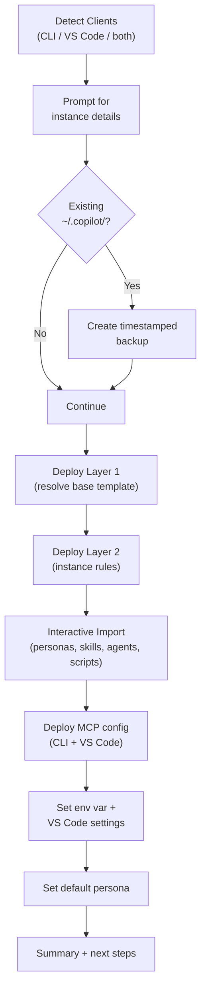

# Init Script — Detailed Workflow

> Back to [README](../README.md#init-script)

The `init.ps1` script deploys the full Copilot CLI environment from this repo to a local machine. This document provides the detailed step-by-step workflow.

## Full Workflow Diagram

## Step-by-Step Breakdown

### 1. Detect Clients

The script auto-detects which Copilot clients are installed:
- **Copilot CLI** — checks for `gh copilot` availability
- **VS Code** — checks for VS Code and/or VS Code Insiders

### 2. Prompt for Instance Details

Collects machine-specific configuration:
- Instance type (`work` or `personal`)
- GitHub account verification
- GitHub projects path (for GitHub-backed projects)

### 3. Backup Existing Config

If `~/.copilot/` already exists, a timestamped backup is created under `~/.copilot-backups/`. Only the 3 most recent backups are retained.

### 4. Deploy Layer 1 — Base Instructions

Resolves `base/copilot-instructions.md.template` by substituting `{{variables}}` (instance type, paths, etc.) and writes to `~/.copilot/copilot-instructions.md`.

### 5. Deploy Layer 2 — Instance Rules

Copies the appropriate instance rules file (`work.instructions.md` or `personal.instructions.md`) to `~/.copilot/personas/active/.github/instructions/instance.instructions.md`.

### 6. Interactive Import

For each content category (personas, skills, agents, scripts), you choose one of:
- **Import All** — accept all new and changed items
- **Skip All** — keep local versions unchanged
- **Review Each** — step through items one at a time with options: Import / Skip / Compare

### 7. Deploy MCP Config

Deploys MCP server configurations using a **JSON-aware merge** that preserves locally-added servers:
- **CLI:** Merges repo profile config (`mcp-config.{profile}.json`) into `~/.copilot/mcp-config.json`
- **VS Code:** Merges `mcp.vscode.universal.json` into `%APPDATA%/Code/User/mcp.json`

**Merge semantics:**
- Repo-defined servers are added or updated (repo is source of truth)
- Locally-added servers (not in repo) are preserved
- Servers removed from the repo since the last deploy are cleaned up
- A sidecar file (`~/.copilot/mcp-repo-servers.json`) tracks which servers came from the repo

On first deploy (no existing file), falls back to a straight copy. If the existing file has invalid JSON, it warns and overwrites.

### 8. Set Environment Variable & VS Code Settings

- Sets `COPILOT_CUSTOM_INSTRUCTIONS_DIRS` to `~/.copilot/personas/active/`
- For VS Code: configures `chat.agentSkillsLocations` to include `~/.copilot/skills/`

### 9. Set Default Persona

Deploys the default persona's `persona.instructions.md` into `personas/active/.github/instructions/persona.instructions.md` (Layer 3).

### 10. Summary & Next Steps

Displays a recap of what was deployed and suggests next steps (e.g., restart terminal, verify with `Switch-CopilotPersona.ps1 -List`).
